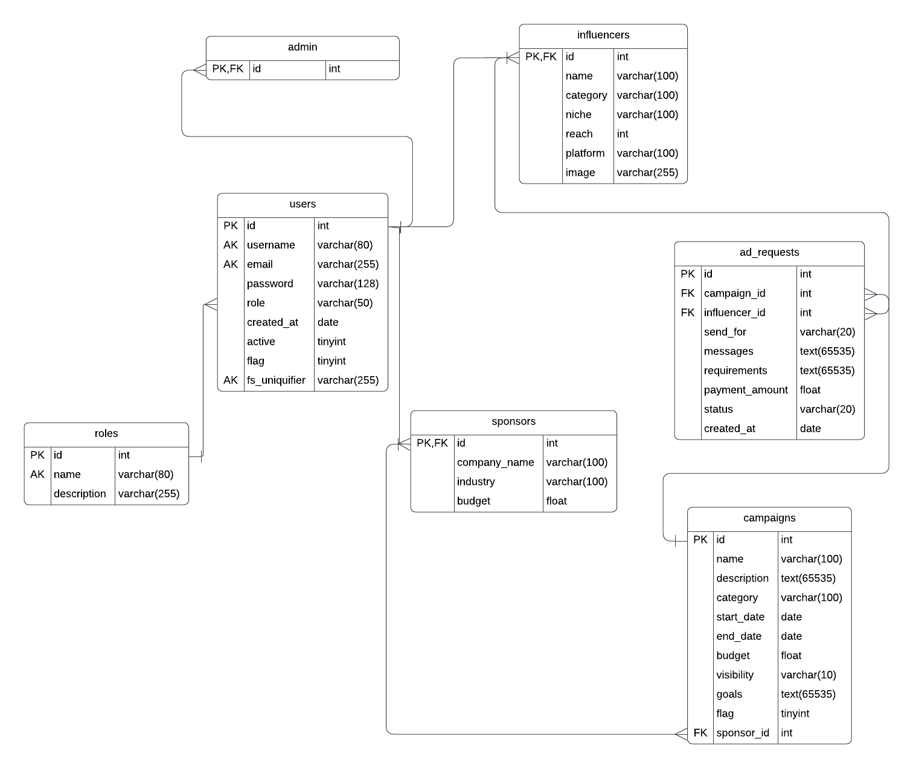

# Influencer Engagement & Sponsorship Coordination Platform

## Project Description

The Influencer Engagement & Sponsorship Coordination Platform is a full-stack web application that facilitates seamless collaboration between sponsors and influencers. The platform provides a comprehensive solution for campaign management, ad request coordination, and performance tracking.

## Architecture

- **Backend:** Flask (Python) with REST API
- **Frontend:** Vue.js
- **Database:** SQLite
- **Authentication:** Flask-Security with token-based authentication
- **Background Tasks:** Celery with Redis
- **Email Service:** Flask-Mail
- **Caching:** Redis

## Key Features

### Authentication & User Management
- **Registration/Login System:** Secure user authentication for Sponsors and Influencers
- **Password Security:** Werkzeug password hashing
- **Token-based Authentication:** Flask-Security generated authentication tokens
- **Role-based Access Control:** Admin, Sponsor, and Influencer roles

### User Roles & Functionalities

#### Admin
- **Automatic Role Creation:** Admin role is created during database initialization
- **User Monitoring:** Full access to monitor all users and campaigns
- **Sponsor Management:** Approve new sponsors and flag suspicious accounts
- **Analytics Dashboard:** Comprehensive statistics and data visualization

#### Sponsors
- **Campaign Management:** Create, modify, and delete advertising campaigns
- **Ad Request Management:** Send, modify, and delete ad requests to influencers
- **Performance Dashboard:** View campaign statistics and performance metrics
- **Monthly Reports:** Automated email reports of campaign and ad request activities

#### Influencers
- **Ad Request Handling:** View, accept, reject, or negotiate incoming ad requests
- **Profile Management:** Update personal and professional information
- **Campaign Discovery:** Search and browse available campaigns
- **Request Submission:** Send requests to sponsors for specific campaigns

### Automated Features

#### Daily Reminders
- **Email Notifications:** Automatic daily reminders sent to influencers with pending ad requests
- **Celery Integration:** Background task scheduling for consistent reminder delivery

#### Monthly Activity Reports
- **Comprehensive Reports:** Detailed campaign and ad request summaries
- **Automated Delivery:** Monthly email reports sent to sponsors
- **Performance Metrics:** Key statistics and insights included

#### Data Export
- **CSV Export:** Campaign details can be downloaded in CSV format
- **Excel Integration:** Flask-Excel for file operations
- **Background Processing:** Celery handles file generation tasks

### Performance Optimization
- **Redis Caching:** Frequently accessed data is cached for improved performance
- **Efficient Database Queries:** Optimized data retrieval and storage
- **Background Task Processing:** Non-blocking operations for better user experience

## Technology Stack

### Backend Technologies
- **Flask** - Web framework for REST API development
- **Flask-RESTful** - RESTful API extension
- **Flask-Security** - User authentication and authorization
- **Flask-Mail** - Email functionality
- **Flask-Excel** - Excel file operations
- **Werkzeug** - Password hashing and security utilities
- **Celery** - Background task processing and scheduling
- **SQLite** - Lightweight database for data storage

### Frontend Technologies
- **Vue.js** - Progressive JavaScript framework for UI
- **Chart.js** - Data visualization and charting
- **HTML & CSS** - Structure and styling

### Infrastructure
- **Redis** - Caching and message broker for Celery
- **SQLite** - Database management system

## Database Schema

The application uses the following data models:
- **Role** - User role definitions
- **User** - Base user information
- **Sponsor** - Sponsor-specific details
- **Influencer** - Influencer-specific details
- **Campaign** - Campaign information and settings
- **AdRequest** - Ad request details and status



## API Documentation

### Campaign Endpoints
- `GET /api/campaigns` - Retrieve all campaigns
- `POST /api/campaigns` - Create new campaign
- `PUT /api/campaign_modify/<int:id>` - Update existing campaign
- `DELETE /api/campaign_modify/<int:id>` - Delete campaign

### Ad Request Endpoints
- `GET /api/ad_requests` - Retrieve all ad requests
- `POST /api/ad_requests` - Create new ad request
- `PUT /api/adrequests_modify/<int:infl_id>/<int:camp_id>` - Update ad request
- `DELETE /api/adrequests_modify/<int:infl_id>/<int:camp_id>` - Delete ad request

## Installation & Setup

1. **Clone the repository**
   ```bash
   git clone [repository-url]
   cd influencer-platform
   ```

2. **Install dependencies**
   ```bash
   pip install -r requirements.txt
   ```

3. **Set up environment variables**
   ```bash
   # Configure database, Redis, and email settings
   export FLASK_APP=app.py
   export FLASK_ENV=development
   ```

4. **Initialize database**
   ```bash
   flask db init
   flask db migrate
   flask db upgrade
   ```

5. **Start Redis server**
   ```bash
   redis-server
   ```

6. **Start Celery worker**
   ```bash
   celery -A app.celery worker --loglevel=info
   ```

7. **Start Celery beat scheduler**
   ```bash
   celery -A app.celery beat --loglevel=info
   ```

8. **Run the application**
   ```bash
   flask run
   ```

## Usage

1. **Admin Access:** Admin credentials are created during database initialization
2. **Sponsor Registration:** New sponsors can register and await admin approval
3. **Influencer Registration:** Influencers can register and immediately access the platform
4. **Campaign Creation:** Approved sponsors can create and manage campaigns
5. **Ad Request Workflow:** Sponsors send requests to influencers who can accept, reject, or negotiate

## Features in Detail

### Dashboard Analytics
- Real-time statistics for all user roles
- Interactive charts and graphs using Chart.js
- Performance metrics and KPIs

### Email Automation
- Daily reminder system for pending requests
- Monthly comprehensive reports
- Automated notification system

### Data Management
- CSV export functionality for campaign data
- Efficient data caching with Redis
- Secure data storage with SQLite

## License

This project is developed as part of MAD2 coursework at IIT Madras.
